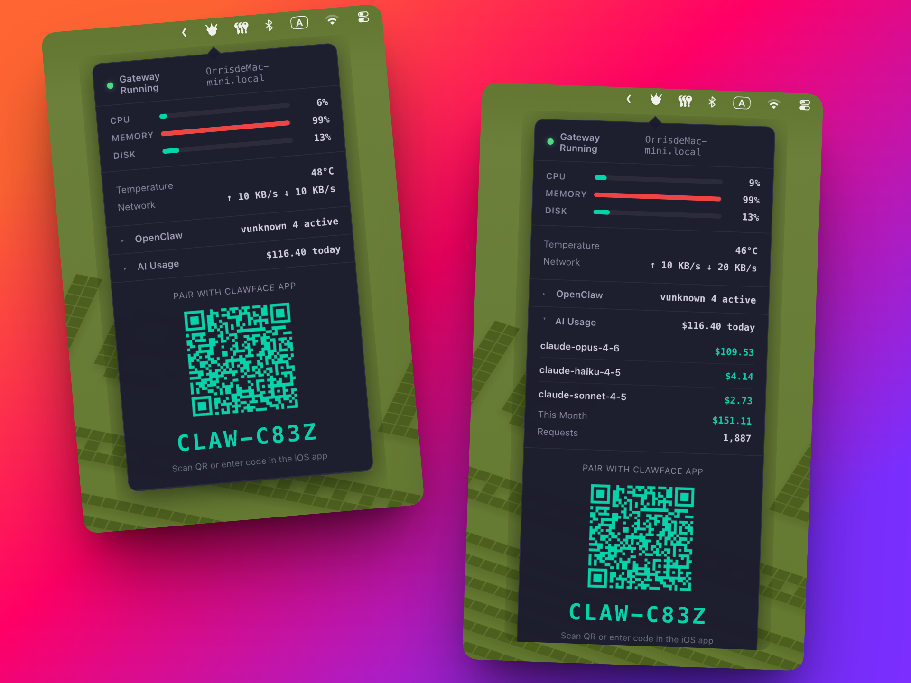

# ClawFace Gateway

A native macOS menu bar app for monitoring your Mac's system health and AI spending. Pairs with the [ClawFace iOS app](https://clawface.app) for remote monitoring from your iPhone.

<p align="center">
  
</p>

## Download

Download the latest `.dmg` from [**Releases**](https://github.com/OrrisTech/clawface/releases).

Open the DMG and drag **ClawFace Gateway** to your Applications folder.

## Features

- **Menu Bar Tray Icon** — Lives in your macOS menu bar as a compact dropdown
- **System Metrics** — CPU, memory, disk usage with color-coded bars; temperature and network speed
- **AI Usage Tracking** — Per-provider and per-model cost breakdown (Anthropic, OpenAI, Google, Deepseek)
- **OpenClaw Monitoring** — Agent status, channels, sessions, context usage, and token counts
- **Device Pairing** — QR code and `CLAW-XXXX` code pairing with the ClawFace iOS app
- **Background Operation** — Runs silently in the menu bar, no terminal needed

## How It Works

```
Mac (Menu Bar App)  ──WebSocket──>  Relay Server  ──WebSocket──>  iPhone App
  System metrics                      Routes messages               Displays data
  AI cost tracking                    Handles pairing                Sends commands
```

The desktop app collects your Mac's system metrics (CPU, memory, disk, temperature, network) and scans local AI tool logs for usage costs. Data streams to your iPhone via a WebSocket relay.

### Supported AI Tools

| Tool | What's Tracked |
|------|---------------|
| **Claude Code** | Input/output tokens, cache reads, per-model costs |
| **OpenAI Codex CLI** | Input/output tokens, cached tokens, per-model costs |

Costs are calculated using built-in pricing tables covering Anthropic (Claude Opus, Sonnet, Haiku), OpenAI (GPT-4o, o1, o3, Codex), Google (Gemini), and Deepseek models.

### Privacy

All data stays local on your Mac. The relay server only routes encrypted WebSocket messages between your Mac and your iPhone — it does not store any monitoring data. Usage data is kept in a local SQLite database at `~/.openclaw/usage.db`.

## Pairing with iPhone

1. Install [ClawFace](https://clawface.app) on your iPhone
2. Launch **ClawFace Gateway** on your Mac (appears in menu bar)
3. Click the tray icon — a pairing QR code and `CLAW-XXXX` code are shown
4. In the iPhone app, go to Settings > Pair Device and enter the code
5. Live data starts streaming immediately

## Build from Source

Requires [Node.js 18+](https://nodejs.org/).

```bash
# Clone the repo
git clone https://github.com/OrrisTech/clawface.git
cd clawface

# Install all dependencies (workspaces: shared, gateway, desktop)
npm install

# Build the gateway
cd gateway && npm run build && cd ..

# Run the desktop app in development mode
cd desktop && npm run dev

# Or build a DMG installer
cd desktop && npm run dist
```

The DMG is output to `desktop/release/`.

## Project Structure

```
clawface/
├── desktop/                       # macOS menu bar app (Electron)
│   └── src/
│       ├── main/                  # Electron main process (tray, IPC)
│       ├── renderer/              # Dropdown panel (HTML/CSS/JS)
│       └── assets/                # Tray icon, app icon
├── gateway/                       # Gateway monitor engine (Node.js)
│   └── src/
│       ├── index.ts               # OpenClawMonitor orchestrator
│       ├── systemCollector.ts     # System metrics collection
│       ├── aiUsageTracker.ts      # AI cost tracking (SQLite)
│       ├── claudeLogScanner.ts    # Claude Code JSONL log parser
│       ├── codexLogScanner.ts     # OpenAI Codex JSONL log parser
│       ├── relayClient.ts         # WebSocket client to relay
│       └── pairManager.ts         # Pairing code generation
├── shared/
│   └── types.ts                   # Shared TypeScript type definitions
├── package.json                   # Workspace root
└── LICENSE
```

## Requirements

- macOS 13 (Ventura) or later
- Apple Silicon (arm64)

## Links

- [ClawFace iOS App](https://clawface.app)
- [Report Issues](https://github.com/OrrisTech/clawface/issues)

## License

[MIT](./LICENSE)
